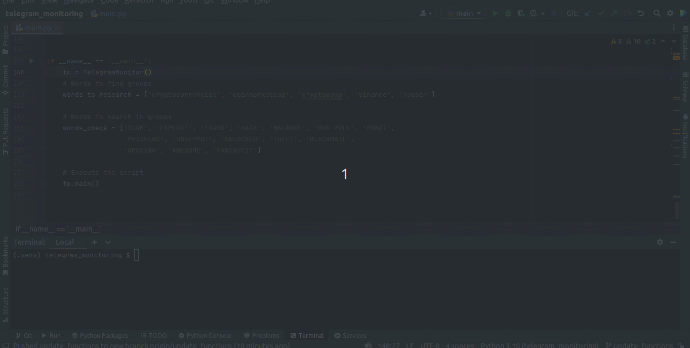

# telegram_monitorng
Python script to search telegram groups by words. Monitor sent messages and forward messages to slack.

## Steps to Run this Python Script

1. Create a virtual machine with this command:
`python -m venv .venv`

2. Create config.py file to set your Api ID and Hash 
(get this in https://my.telegram.org/auth):
api_id; api_hash; username; phone

3. Install the libraries:
`pip install -r requirements. txt`

4. Execute the main.py file.

## Example
